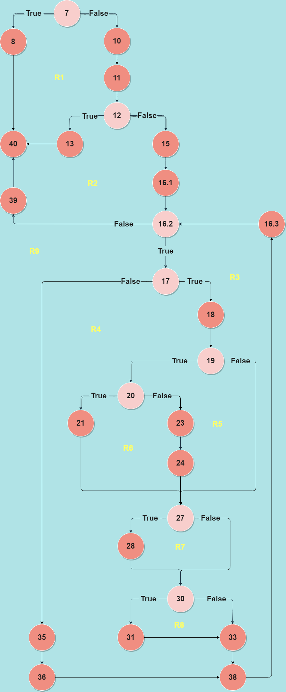

# Маја Вуевска 203007

## Control Flow Graph


## Цикломатска комплексност

**Цикломатската комплексност на овој код изнесува 9.** <br>
Таа може да се пресмета на три начини. <br> 
Прв начин: број на врски - број на јазли + 2 (E - N + 2), односно во нашиот 
случај тоа е 34 - 27 + 2 = 9. <br>
Втор начин: број на предикатни јазли + 1. Во кодот има 8 предикатни јазли, 
значи цикломатската комплексност е 9. Предикатните јазли се јазлите претставени со светло розева боја во Control Flow Graph.<br>
Трет начин: број на региони кои исто така се 9. Регионите се исто така претставени во графот, тие се броевите од R1-R9 претставени во жолта боја. 

## Тест случаи според Every Statement критериумот

| **Every Statement (C0)** 	| **list = null;** 	| **list = ["0", #",   "0"]** 	| **list = ["0", "#", "#", "0", "#", "0", "#", "0", "0", "#", "0", "0", "#", "#", "0", "0"]** 	|
|---	|:---:	|:---:	|:---:	|
| 7 	| * 	| * 	| * 	|
| 8 	| * 	|  	|  	|
| 10 	|  	| * 	| * 	|
| 11 	|  	| * 	| * 	|
| 12 	|  	| * 	| * 	|
| 13 	|  	| * 	|  	|
| 15 	|  	|  	| * 	|
| 16.1 	|  	|  	| * 	|
| 16.2 	|  	|  	| * 	|
| 16.3 	|  	|  	| * 	|
| 17 	|  	|  	| * 	|
| 18 	|  	|  	| * 	|
| 19 	|  	|  	| * 	|
| 20 	|  	|  	| * 	|
| 21 	|  	|  	| * 	|
| 23 	|  	|  	| * 	|
| 24 	|  	|  	| * 	|
| 27 	|  	|  	| * 	|
| 28 	|  	|  	| * 	|
| 30 	|  	|  	| * 	|
| 31 	|  	|  	| * 	|
| 33 	|  	|  	| * 	|
| 35 	|  	|  	| * 	|
| 36 	|  	|  	| * 	|
| 38    |   |   | *     |
| 39 	|  	|  	| * 	|
| 40 	| * 	| * 	| *	|                                                 	|

## Тест случаи според Every Branch критериумот

| **Every Branch(C1)** | **list = null** | **list = ["0", #", "0"]** | **list = ["0", "#", "#", "0", "#", "0", "#", "0", "0", "#", "0", "0", "#", "#", "0", "0"]** |
|----------------------|:---------------:|:-------------------------:|:--------------------------------------------------------:|
| 7-8                  | *               |                           |                                                          |
| 7-10                 |                 | *                         | *                                                        |
| 8-40                 | *               |                           |                                                          |
| 10-11                |                 | *                         | *                                                        |
| 11-12                |                 | *                         | *                                                        |
| 12-13                |                 | *                         |                                                          |
| 12-15                |                 |                           | *                                                        |
| 13-40                |                 | *                         |                                                          |
| 15-16.1              |                 |                           | *                                                        |
| 16.1-16.2            |                 |                           | *                                                        |
| 16.2-17              |                 |                           | *                                                        |
| 17-18                |                 |                           | *                                                        |
| 17-35                |                 |                           | *                                                        |
| 35-36                |                 |                           | *                                                        |
| 18-19                |                 |                           | *                                                        |
| 19-20                |                 |                           | *                                                        |
| 19-27                |                 |                           | *                                                        |
| 20-21                |                 |                           | *                                                        |
| 20-23                |                 |                           | *                                                        |
| 21-27                |                 |                           | *                                                        |
| 23-24                |                 |                           | *                                                        |
| 24-27                |                 |                           | *                                                        |
| 27-28                |                 |                           | *                                                        |
| 27-30                |                 |                           | *                                                        |
| 28-30                |                 |                           | *                                                        |
| 30-31                |                 |                           | *                                                        |
| 30-33                |                 |                           | *                                                        |  
| 31-33                |                 |                           | *                                                        | 
| 33-38                |                 |                           | *                                                        |
| 36-38                |                 |                           | *                                                        |
| 38-16.3              |                 |                           | *                                                        |
| 16.3-16.2            |                 |                           | *                                                        |
| 16.2-39              |                 |                           | *                                                        |
| 39-40                |                 |                           | *                                                        |

### Објаснување на напишаните unit tests

Двата критериуми, Every Statement и Every Branch, се покриени со 3 тест случаи. Поради тоа напишав една функција со следното име каде ги тестирав тие случаи: <br>
```java
    @Test
    void everyStatementAndEveryBranchTest() {}
```
Бидејќи во самиот код има 3 можни опции кои би можеле да се вратат како резултат на функцијата, поради тоа напишав и три тест случаи. Односно првиот тест случај кој го тестирав е каде листата која се праќа како аргумент на функцијата е празна. Со тоа нејзината големина е помала од 0, па се фрла исклучок од типот IllegalArgumentException. Тестот е следниот: <br>

```java
    IllegalArgumentException exception; 
    exception = assertThrows(IllegalArgumentException.class, () -> SILab2.function(createList())); 
    assertTrue(exception.getMessage().contains("List length should be greater than 0"));
```

Втортиот тест случај е каде листата содржи број на елементи од кои не може да се добие цел број доколку се пресмета квадратен корен од истиот број. Се фрла истиот исклучок бидејќи не може да се пресмета квадратен корен од бројот 3, односно должината на листата. Тест случајот е следниот: <br>

```java
    exception = assertThrows(IllegalArgumentException.class, () -> SILab2.function(createList("0", "#", "0")));
    assertTrue(exception.getMessage().contains("List length should be a perfect square"));
```

Последниот тест случај е листа која има должина која е поголема од нула и број на елементи кои можат да се квадрираат (бројот на елементи е 16, што значи дека квадратен корен од 16 е 4, што е цел број). Потоа се пресметува новата низа која се враќа назад како аргумент. Тест случајот: <br>

```java
    /*  
    input:      output:
    0 # # 0     2 # # 1
    # 0 # 0     # 4 # 1
    0 # 0 0     3 # 2 0
    # # 0 0     # # 1 0
    */
    List<String> expected = new ArrayList<>(Arrays.asList("2", "#", "#", "1", "#", "4", "#", "1", "3", "#", "2", "0", "#", "#", "1", "0"));
    assertEquals(expected, SILab2.function(createList("0", "#", "#", "0", "#", "0", "#", "0", "0", "#", "0", "0", "#", "#", "0", "0")));
```

Со помош на овие тестови се покриени и двата критериуми. <br>
Напомена: за точно извршување на тестовите ја напишав помошната функција ```createList(String... elements)``` која зема елементи од типот String како влезни аргументи и истите ги враќа во листа. Таа листа ни е потребна при повикување/тестирање на функцијата ```function(List<String> list)``` од класата ```SILab2```. Функцијата е следната:<br>

```java
    private List<String> createList(String... elements) {
        return new ArrayList<>(Arrays.asList(elements));
    }
```